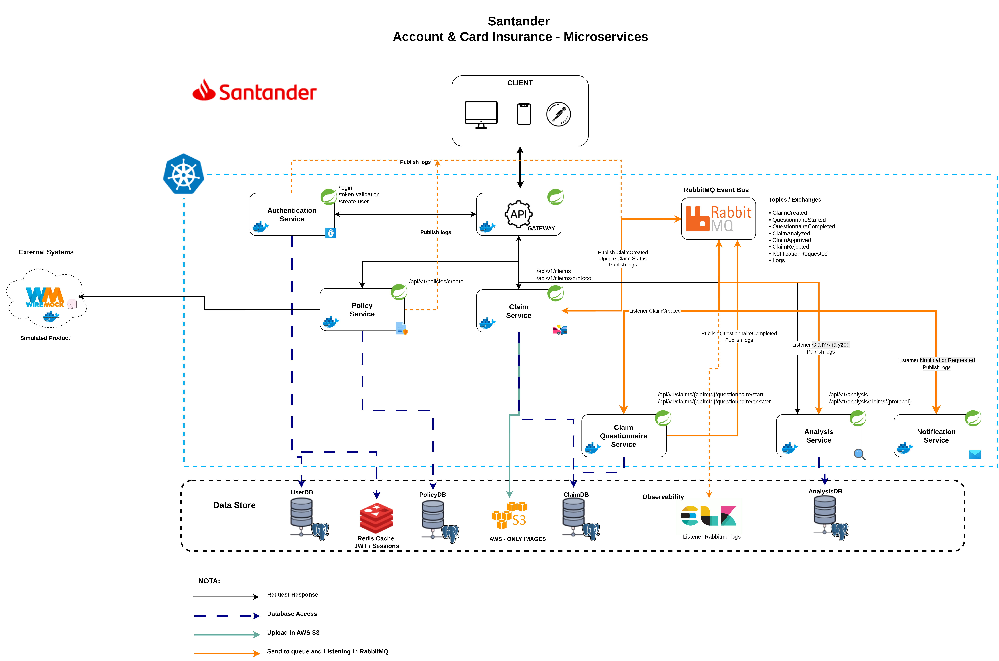
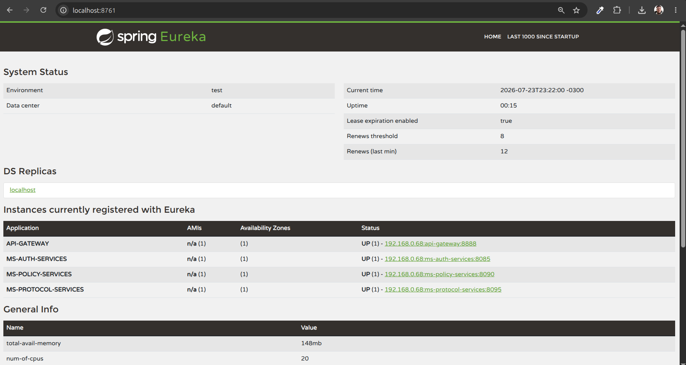
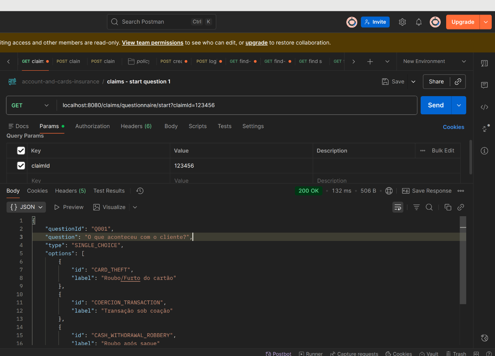
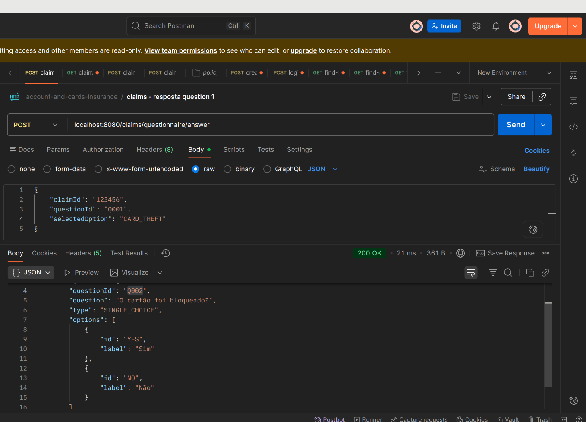
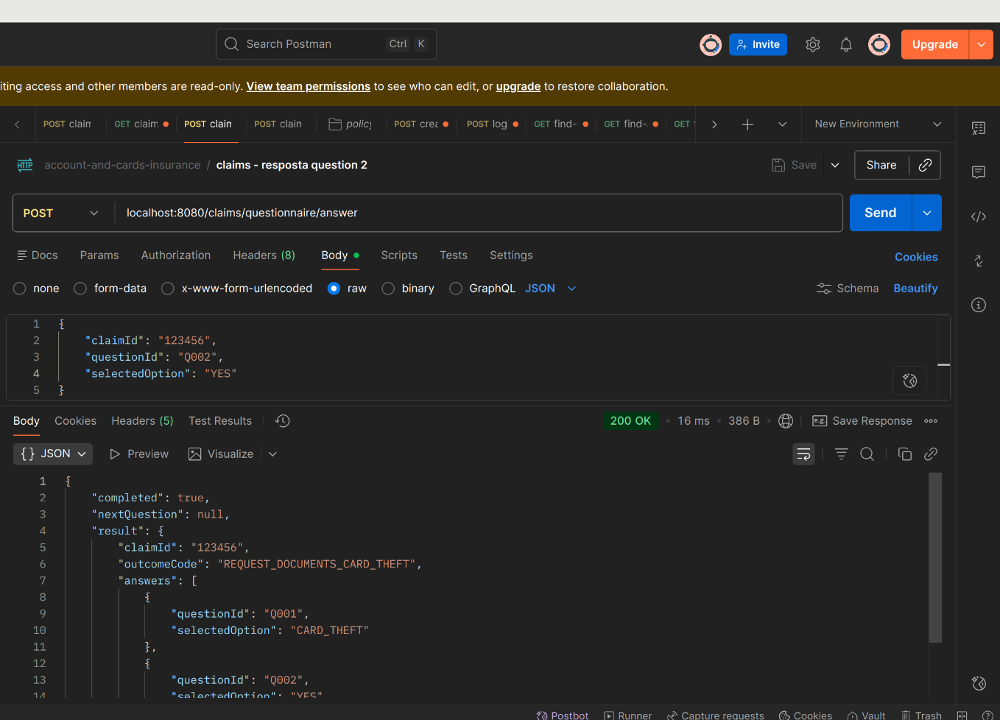

# Account & Card Insurance — Microservices

**Santander's Account and Card Insurance** protects a customer's bank account and cards against certain types of losses caused by **theft, coercion, and unauthorized use**. This repository implements the platform as a set of Spring Boot microservices, orchestrated with Kubernetes/Docker, communicating synchronously via REST and asynchronously via **RabbitMQ**.

## Architecture Overview



The system follows a microservices architecture with:

- **Synchronous communication** (REST) for direct client-facing requests (login, policy creation, claim submission, etc.), routed through an **API Gateway**.
- **Asynchronous communication** (events) for the claim lifecycle — from creation through questionnaire, analysis, approval/rejection, and notification — decoupled through a **RabbitMQ** event bus.
- **Centralized service discovery** via **Eureka**.
- **Centralized logging** — every service publishes structured logs to RabbitMQ, which are shipped to the **ELK stack** for observability.

## Flow
<pre>
                           INÍCIO
                              │
                              ▼
                O que aconteceu com o cliente?
                              │
      ┌───────────────┬───────────────┬───────────────┬───────────────┐
      │               │               │               │
      ▼               ▼               ▼               ▼
 Roubo/Furto      Transação        Saque com      Roubo de
 do cartão        sob coação       roubo          bens pessoais
      │               │               │               │
      ▼               ▼               ▼               ▼
 Cartão foi      Cliente foi     O dinheiro      Bolsa/mochila/
 bloqueado?      obrigado a      foi roubado     carteira foi
                 fazer Pix,       até 8 horas     roubada junto
                 saque ou compra  após saque?     com o cartão?
      │               │               │               │
   Sim│ Não       Sim │ Não       Sim │ Não       Sim │ Não
      ▼               ▼               ▼               ▼
 Solicitar      Avaliar se      Solicitar      Verificar se
 documentos     há cobertura    documentos     os bens estão
 e abrir        pela apólice    e abrir        previstos na
 sinistro                       sinistro       cobertura
      │               │               │               │
      └───────────────┴───────────────┴───────────────┘
                              │
                              ▼
                 Enviar documentação exigida
                              │
                              ▼
                 Análise da seguradora
                              │
                    ┌─────────┴─────────┐
                    │                   │
                    ▼                   ▼
            Cobertura aprovada    Cobertura negada
                    │                   │
                    ▼                   ▼
        Indenização/Assistência   Informar motivo
             conforme apólice     e orientar cliente
</pre>

## The project is still in the development phase.
### Eureka Server 

### Submitting the questionnaire




## Services

| Service | Responsibility |
|---|---|
| **API Gateway** | Single entry point for all client requests; routes to downstream services. |
| **Eureka Service** | Service registry/discovery for all microservices. |
| **Authentication Service** | Login, token validation, and user creation (`/login`, `/token-validation`, `/create-user`). Issues/validates JWT and manages sessions via **Redis**. |
| **Policy Service** | Creates and manages insurance policies (`/api/v1/policies/create`); integrates with a simulated external product via **WireMock**. |
| **Claim Service** | Registers claims and manages claim protocols (`/api/v1/claims`, `/api/v1/claims/protocol`); publishes `ClaimCreated` events and claim status updates; stores claim attachments/images in **AWS S3**. |
| **Claim Questionnaire Service** | Handles the dynamic claim triage questionnaire (`/api/v1/claims/{claimId}/questionnaire/start`, `/api/v1/claims/{claimId}/questionnaire/answer`); listens for `ClaimCreated` and publishes `QuestionnaireCompleted`. |
| **Analysis Service** | Analyzes completed claims (`/api/v1/analysis`, `/api/v1/analysis/claims/{protocol}`); listens for `QuestionnaireCompleted`/analysis triggers and publishes `ClaimAnalyzed`. |
| **Notification Service** | Sends notifications to customers; listens for `NotificationRequested` events. |

## Event-Driven Flow (RabbitMQ)

All asynchronous communication flows through a **RabbitMQ Event Bus**. Key topics/exchanges:

- `ClaimCreated`
- `QuestionnaireStarted`
- `QuestionnaireCompleted`
- `ClaimAnalyzed`
- `ClaimApproved`
- `ClaimRejected`
- `NotificationRequested`
- `Logs` (centralized log shipping to observability stack)

**Typical claim lifecycle:**

1. Client submits a claim → **Claim Service** persists it and publishes `ClaimCreated`.
2. **Claim Questionnaire Service** listens for `ClaimCreated`, guides the customer through a dynamic triage questionnaire, and publishes `QuestionnaireCompleted` once finished.
3. **Analysis Service** listens for the completed questionnaire, evaluates the claim, and publishes `ClaimAnalyzed` (leading to `ClaimApproved`/`ClaimRejected`).
4. **Claim Service** listens for `ClaimAnalyzed` to update the claim status.
5. **Notification Service** listens for `NotificationRequested` and notifies the customer.

## Data Store

| Store | Used by | Purpose |
|---|---|---|
| **UserDB** (PostgreSQL) | Authentication Service | User credentials and accounts. |
| **Redis Cache** | Authentication Service | JWT/session storage. |
| **PolicyDB** (PostgreSQL) | Policy Service | Insurance policies. |
| **ClaimDB** (PostgreSQL) | Claim Service, Claim Questionnaire Service | Claims, protocols, and questionnaire answers. |
| **AWS S3** | Claim Service | Claim attachment/image storage only. |
| **AnalysisDB** (PostgreSQL) | Analysis Service | Claim analysis results. |

## External Systems

- **WireMock** simulates the external insured product/account system that the Policy Service integrates with, for local development and testing without a live dependency.

## Observability

Every service publishes structured (JSON) logs to RabbitMQ, which are consumed and indexed by the **ELK** stack for centralized log search and monitoring.

## Tech Stack

- **Java** / **Spring Boot** (Spring Cloud Gateway, Spring Cloud Netflix Eureka, Spring Security/OAuth2 Resource Server, Spring Data JPA, Spring AMQP)
- **PostgreSQL** — relational persistence per service
- **Redis** — session/JWT cache
- **RabbitMQ** — event bus and centralized log shipping
- **AWS S3** — claim attachment storage
- **WireMock** — simulated external dependencies
- **ELK Stack** — log aggregation and observability
- **Docker** / **Docker Compose** — containerization and local orchestration
- **Kubernetes** — target deployment platform

## Repository Structure

```
account-and-card-insurance/
├── api-gateway/
├── eureka-service/
├── ms-auth-services/
├── ms-policy-services/
├── ms-claims-services/
├── ms-claims-questionnaire-services/
├── ms-analysis-services/
├── ms-notification-services/
└── docker-compose.yaml
```

## Getting Started

### Prerequisites

- Java 17+ (or the version configured in each service's `pom.xml`)
- Maven
- Docker & Docker Compose
- PostgreSQL, Redis, and RabbitMQ (provided via `docker-compose.yaml`)

### Running locally

```bash
# Build each service
./mvnw clean package -DskipTests

# Start infrastructure and services
docker-compose up -d
```

Once running:

- **Eureka dashboard**: `http://localhost:8761`
- **API Gateway**: entry point for all client requests
- **RabbitMQ Management UI**: `http://localhost:15672`

Each service exposes its own Swagger/OpenAPI documentation (via `springdoc`) at `/swagger-ui.html`.

## Diagram Legend

| Symbol | Meaning |
|---|---|
| Black solid arrow | Request-Response |
| Dark blue dashed arrow | Database Access |
| Teal solid arrow | Upload to AWS S3 |
| Orange solid arrow | Send to queue / Listening in RabbitMQ |

## License

This project is provided for educational/portfolio purposes as a simulation of an insurance claims platform.
